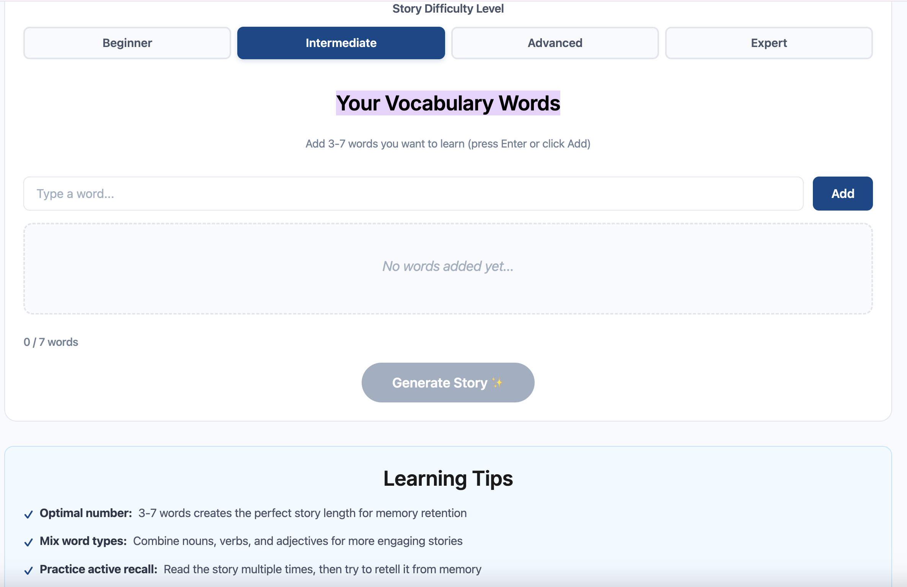
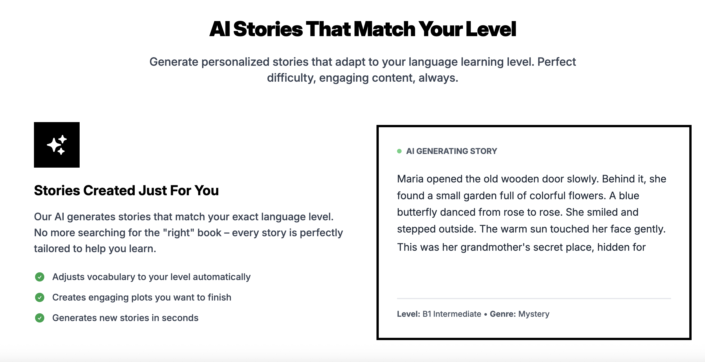
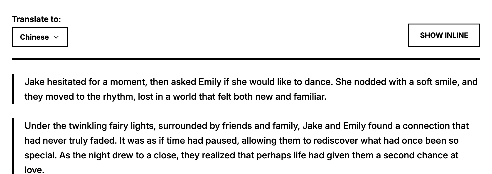
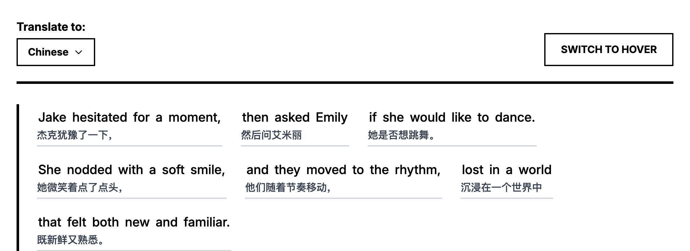
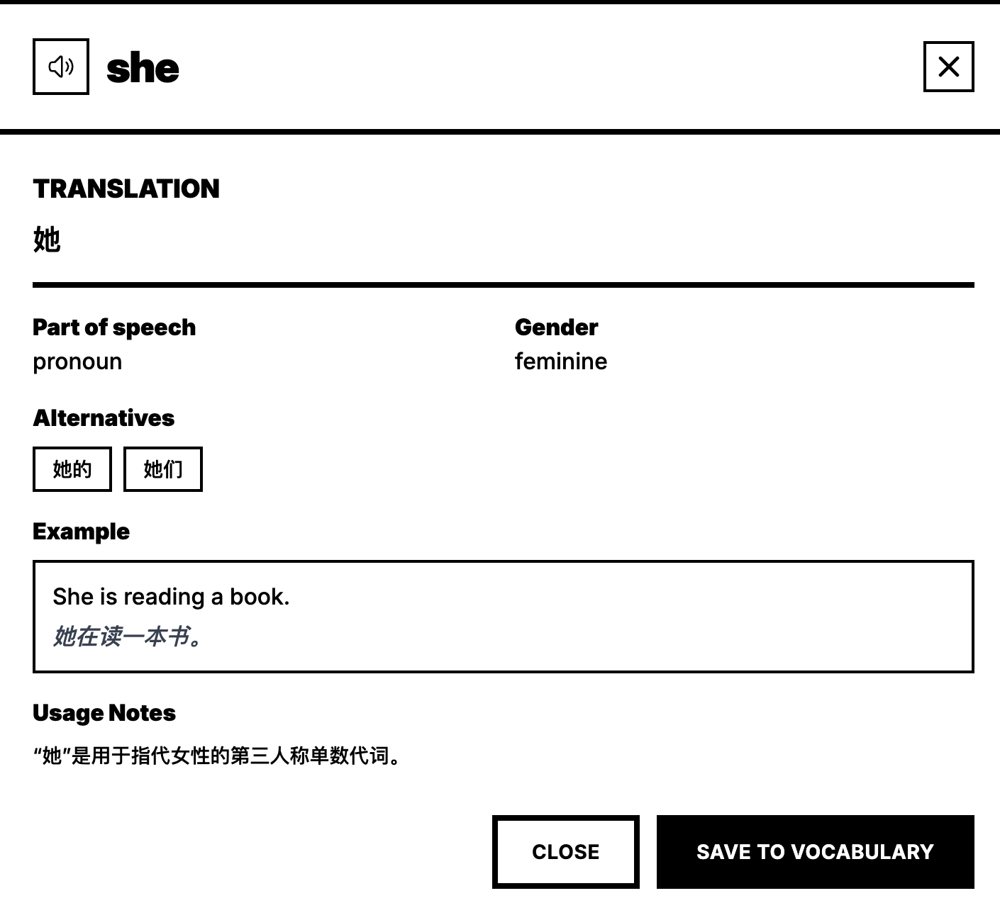
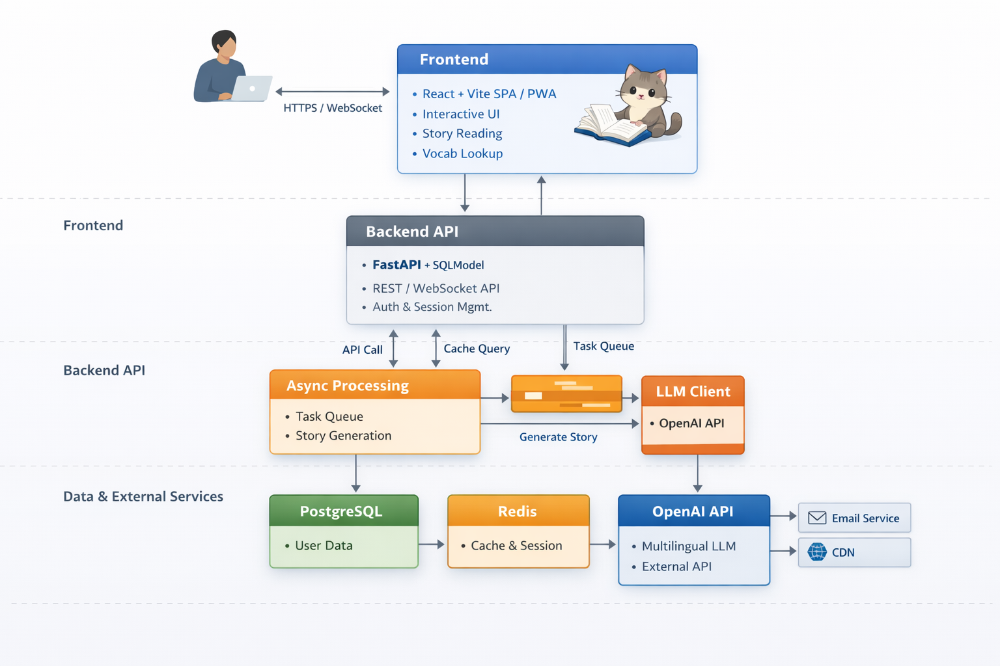
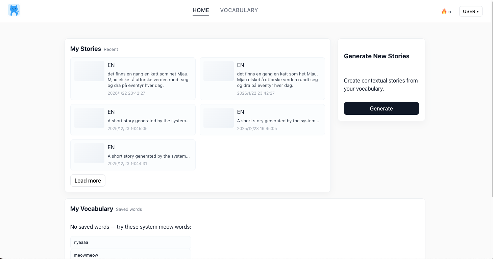
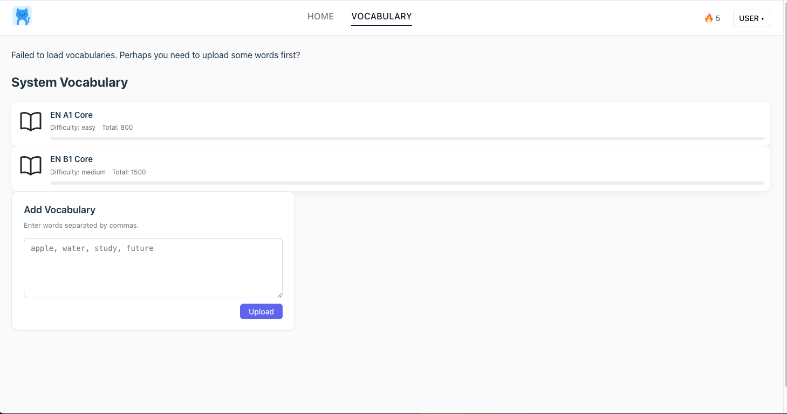

# Meowmory — System Design

## 1. Vision
- Elevator pitch:
- Core problems:
- Target users:
- KPIs:

## 2. User Requirements
### Key scenarios
- Scenario 1: ...
### User stories
- As a ..., I want ..., so that ...

## 3. Functional Requirements
### Module: Word Management
- Description:
- Inputs/Outputs:
- Acceptance criteria:
- Priority:

...（依此类推）

## 4. Non-Functional Requirements
- Performance:
- Availability:
...

## 5. System Architecture
(插入架构图链接/路径)
- Overview:
- Tech stack:
- Data flow:

## 6. Database Design
(插入 ER 图链接/路径)
- Tables:
  - users: id, email, ...
  - word: id, lemma, ...

## 7. Roadmap
- MVP (Date) — deliverables:
- v1 (Date) — deliverables:

## Appendix
- Terms:
- Open questions:

------------------

目录（建议放在文档开头）

Vision（产品愿景）

Competition(竞品分析)

User Requirements（用户需求）

Functional Requirements（功能需求）

Non-Functional Requirements（NFR，非功能需求）

System Architecture（系统架构草案）

Database Design（数据库设计 / ER 图）

Roadmap（项目路线图）

Appendix（术语、开放问题、参考资料）


## 1. Vision（产品愿景）


要回答的问题（每项都写清楚、可测量）
### 为什么要做Meowmory
重复和在真实的文章中学习词汇是更高效的方法；当前基于 AI 的词汇学习产品已经能够“生成内容”，但仍未解决一个核心问题：如何围绕用户真实的学习目标，生成既自然又具有学习价值的语境内容。

一方面，应试型产品虽然能快速覆盖目标词表，但生成文本往往生硬、缺乏真实语言使用场景；另一方面，兴趣驱动型阅读工具生成的内容自然，但难以精确服务于用户已有的教材、课程或考试目标。

Meowmory 诞生的动机，是在这两者之间建立一座桥梁：以用户提供的词表或者系统自带词表为输入，用大模型生成可控、自然、可重复使用的短故事，从而让背单词成为一个轻量、可持续的学习过程，而非一次性消耗。  
### 产品一句话描述：这个产品是什么？（elevator pitch）
Meowmory 是一个基于大语言模型的网页工具，用户选择系统自单词表或者提供自己的单词表，即可生成符合指定语言、难度与风格的短故事，在真实语境中高效记忆词汇。


### 我们要解决的核心问题是什么？用户当前的痛点有哪些？（用场景/故事说明）
+ 核心问题：
现有词汇学习工具难以同时满足以下三点：

      精确覆盖已有的目标词表

      生成自然、生活化、符合语言使用习惯的文本

      支持不同语言、难度与学习目标的灵活切换

+ 典型场景：

      用户手中已有一份教材或课程词表，但不想再刷机械例句

      用户希望在轻松阅读中“顺便”巩固词汇，而不是进入完整阅读课程

      用户使用非英语语言学习资源，但缺乏高质量情境内容

### 产品的核心价值（至少 2–3 条）——用户为什么会选择我们？

词表优先（Vocabulary-first）
以系统默认或者用户提供的单词表作为生成内容的核心约束

可控生成（Controllable Generation）
支持语言、难度、风格、故事引子等维度的组合控制，确保内容既自然又服务学习目标。

低门槛、即插即用
无需长期课程或复杂配置，适合作为现有学习流程的补充工具。

### 目标用户 / 用户细分（Persona 概览）：谁会使用？（举 2 个最重要的 persona）
Persona 1：目标导向型语言学习者

      背景：大学生 / 自学者

      目标：掌握教材或课程指定词汇

      痛点：现有应试工具内容生硬，难以迁移到真实语境

      使用场景：每日 10–15 分钟，通过故事复习当天词表

Persona 2：轻量兴趣型学习者

      背景：多语言兴趣学习者

      目标：在阅读中自然积累词汇

      痛点：阅读材料难度不稳定，词汇覆盖不可控

      使用场景：选择主题与难度，生成短故事进行碎片化阅读

### 商业 / 非商业目标：我们希望通过这个产品达到什么（留存、付费、品牌曝光等）
验证用户使用系统自带词表的效果

验证用户是否愿意主动导入并反复使用词表

建立“AI 情境化背词”的产品认知

为后续订阅制或高级生成能力打基础

### 成功指标（KPIs）：如何衡量成功？（例如：DAU、留存率 7d、每用户学习时长）
7 日留存率 ≥ 25%（首次生成后持续使用）

人均每周生成故事数 ≥ 3

≥ 40% 活跃用户至少导入 2 份不同词表

### 假设（Assumptions）与风险：我们基于哪些未经证实的假设？主要风险是什么？
+ 关键假设

      用户愿意为“更自然的语境化学习”付出轻量输入成本

      人为设计的大模型在 15–20 个词汇规模下仍能保持语义与语言质量

+ 主要风险

      生成质量不稳定影响信任

      用户低估词表输入价值，回退到传统工具


## 2.竞品分析
### 结论
AI 故事生成已成为词汇学习产品的重要发展方向，但当前市场中的解决方案仍未充分覆盖用户的真实需求。尽管多数产品引入了 GPT 等大模型技术，其能力更多停留在“可以生成内容”，而非“为特定学习目标生成合适内容”。

现有工具在多语言支持、自定义单词表、学习难度与风格控制等方面普遍存在短板，尤其是在同时服务兴趣驱动型学习者与目标导向型（如教材或考试）学习者时，缺乏统一且灵活的设计方案。这直接导致生成文本在自然度、准确性和学习价值之间难以兼顾。

基于此，市场仍存在明确的差异化空间：一种即插即用、以用户词表为输入、支持多语言与多难度控制、并能生成高质量自然故事的网页端工具，有潜力弥补现有产品的不足。只要在生成质量、定制能力与使用体验上进行针对性优化，基于大模型的情景化背词工具依然具备清晰的产品价值与落地前景。
### 市面现有产品/服务
1. [XlatorHub Vocabulary Story Generator](https://xlatorhub.com/vocabulary-story-generator) 是一款基于英语的在线工具，用户输入3–7个单词（不限语言）以及选择目标故事难度后点击“Generate Story”，AI便自动创作一篇包含这些单词的短文。页面提示“将单词添加到故事”，并内置学习提示，如“上下文关键：情境学习记忆效果更佳”. 


2. 扇贝单词（Shanbay） 是中国的知名英语背词App，在「词文串学」功能中会根据用户学习的词汇生成高质量短文。其官网明确介绍：“故事背单词：AI可根据用户选择的单词，自动生成短文故事以辅助记忆”。下图即为扇贝单词官方宣传界面。


3. [安贝记单词](abword.cn) 是一款AI驱动的个性化单词学习平台，面向少儿用户。官网介绍：AI根据用户兴趣生成个性化创作主题，并将目标单词智能融入故事、漫画、视频、音频等多种形式中。其界面引导用户“选择兴趣主题→AI生成内容→完成创作学习”，突出“通过故事情节加深单词印象”.

4. GRE3000词 App（学而思GRE） 面向GRE考生。新闻报道指出新版APP接入“Deepseek”大模型AI助记，用户记完单词后可选择主题（或自定义），AI即根据该组单词生成专属的趣味小故事。例如选定“歌手”主题，系统会结合已背单词自动生成段落故事。


5. CreateMaster 智能创作助手（iOS应用，由孙浩亮开发）集成了AI写作功能。在其App Store介绍中提到新增了“边读故事边学外语模式”，可将复杂单词编成有趣小故事来辅助记忆。


6. Remember AI 英语单词学习助手（remember.top） 是一个全功能在线平台。其“AI故事”功能允许用户选择多个单词，AI便为其“创造一个有趣的故事和配图”以加深记忆。此外该平台支持自定义单词书、故事存储和AI对话等。

7. EchoRead（https://echoread.app）面向多语种（以主要几种语言，如英语、法语、日语为基础页面，提供数十个语种（母语）到数十个语种（目标）的学习）学习者，是一款生成可定制难度（初学者、中等、进阶）和风格阅读材料的应用。其功能介绍显示：可“生成基于智能词汇的个性化故事”，帮助用户在不同语境中复习保存的单词。该平台强调多语言支持，可根据用户保存的生词自动生成契合其水平的故事。该平台没有使用streaming形式给出故事。


以上产品/服务各有侧重：有的以考试备考为主（如扇贝背单词、GRE3000词），有的主打趣味学习（安贝记单词），也有面向通用学习者或内容创作者（XlatorHub、Remember、EchoRead）。它们几乎都采用了AI生成故事或情境对话的方式。例如扇贝和GRE3000明确集成大模型（Deepseek）来生成语境化文本；EchoRead使用AI根据词汇生成故事；CreateMaster等工具也依赖先进的语言模型。AI模型依赖方面，多数产品宣称使用GPT-4、Claude等大模型或自主大规模预训练模型（如“Deepseek大模型”）来生成内容。

### 目标用户与使用场景

考试备考型：扇贝单词、GRE3000词、趣碰词等面向中学生及成人考生，突出四六级、考研、GRE等考试词汇，目标用户以应试学习者为主. 

兴趣驱动型/少儿学习：安贝记单词主打儿童兴趣主题（科幻、动漫、美食等），适合小学至初中学龄儿童；

通用语言学习者：XlatorHub、Remember、EchoRead等面向广泛语言学习者。这些工具不限于特定考试，更偏向提升词汇记忆效率和语言能力（EchoRead强调多语种阅读练习；XlatorHub为AI翻译/学习工具集之一）。CreateMaster 则提供多语言环境。

内容创作者/教育者：HyperWrite等AI写作工具也可用于词汇练习，但其目标群体包括作家、教师等更广泛用户。EchoRead和安贝记单词也通过生成故事或阅读材料，吸引需要连续阅读练习的进阶学习者。

### AI故事生成技术应用

上述产品几乎都采用了生成式AI。扇贝单词自称融合了“百亿学习数据”与DeepSeek大模型技术；安贝等平台也宣传“AI创作”、“AI生成”故事。它们背后的技术通常是GPT-4、Claude 3 或各自训练的大语言模型等，使系统能自动将给定单词（这几个平台通常是系统自带的）编织入连贯情节。比如GRE3000词APP直接说明“Deepseek大模型AI助力”生成基于GRE某个主题的单词的故事。

Remember和EchoRead等明确以AI模型为后端，根据用户选择或保存的词汇生成对话或故事。其中，EchoRead提供更广泛的语言支持，难度、风格、故事引子多样。但是不支持自定义单词表，它更像是告诉大模型产出的文章为“符合B1水平的浪漫的，以‘第二次爱的机会为题’的英文文章“。但是用户可以添加生词(或者短语)到vocabulary，对于添加进来的单词可以进一步生成更多的文章作为“复习”。值得一说的是，这种冷启动的方式只适合于兴趣驱动型的学习者，并不适合一开始就有目标的（比如有教材或者考试需求）的学习者。作为对比，考试备考型软件虽然冷启动满足用户目标的速度很快，但是所产出的文字缺乏泛化或者探索的能力，比如真实的文章不会把那么多的GRE词汇放在一起。此外EchoRead在展示文章时提供内联模式（incline）和浮动模式（hover），满足阅读文章和解释文章的需求。EchoRead也提供了单词的查词功能.





CreateMaster提及“最新AI技术”实现故事模式（从实际形式上更接近套壳chatbot）

综上，大多数相关产品依赖强大的语言模型来生成内容，少数可能采用更简单的模板方法，但主流趋势是利用GPT类模型实现定制化故事创作。

### 用户反馈与不足

目前公开渠道上对这些产品的用户反馈不多，但常见顾虑包括：生成的故事质量不稳定，有时情节牵强或语言不够自然；语言支持单一（绝大部分工具仅针对英语，少有对其他语言的故事生成功能）；使用门槛方面，一些工具需注册或付费，而且部分界面复杂，初学者需要时间上手。

纵观所有产品，我们可以总结目前的一些不足主要集中在：定制化（定制语言支持、难度、风格、故事引子和单词表）和目标导向（兴趣还是应试）之间的平衡；以及由此带来的文字泛化、生活化和文章准确性、自然性之间的平衡问题

总体来看，现有工具虽在功能上很具创新，但也常被吐槽效果参差、需要改进故事多样性和自然度，以及在目标和效果之间的平衡。

### 市场空白与差异化分析

总结调研结果，市场上已经有多款词汇学习工具采用了情境化或故事化的记忆法，且不少产品已集成了AI生成功能（尤其针对英语词汇）。但仍存在一些空白：跨多语种支持较弱，绝大部分聚焦英语，少有工具同时支持如中文、日语等其他语言的故事背词；生成内容质量参差不齐，用户期待更流畅自然、高质量的故事；用户体验上，不少工具操作复杂或面向移动端，缺乏简洁的网页工具。缺少一种即插即用、用户自主选择词表即可得到高质量故事生成的通用平台。从产品目标来看，当前市场上的工具尚无法同时满足定制语言支持、难度控制、风格设定、故事引子生成以及单词表适配等需求，也难以在兼顾兴趣驱动与应试需求的同时实现整体优化。

因此，如果新工具能够利用GPT等大模型高质量地将用户指定的词汇编入故事，并解决现有工具的缺点（例如支持多语言、提供流畅自然的文本、简化操作流程、定制化需求以及内置词表），则具有潜在差异化优势。我们的方案如果能多语言通用、输出内容自然贴合学习水平，并在网页端提供一站式体验，就能弥补现有产品覆盖不足的痛点。综上所述，基于大模型自动生成情景故事式背词的工具在市场上已有竞争，但只要技术与体验优化到位，确实有机会提供更好的解决方案，满足用户对“有趣高效记单词”的需求。

## 3. User Requirements（用户需求）
目的：把 Vision 中的问题细化为具体用户需求（WHAT & WHEN），为功能需求提供输入

要回答的问题 / 子项

### 主要使用场景（User Journeys）：列出 4–6 个关键场景（例如：添加单词 → 复习 → 查看进度 → 导入导出）
每个场景写出触发条件、用户目标、成功标准

用户故事（User Stories），格式 As a <persona>, I want <goal>, so that <benefit>。优先列 8–12 条关键用户故事，标注优先级（Must/Should/Could）


+ 场景 1：使用系统自带词表生成故事（冷启动）

**触发条件**
用户第一次访问 Meowmory，尚未准备或不想导入自己的词表。

**用户目标**
快速理解产品能做什么，并在低成本下体验“词表 → 故事”的学习方式。

**用户行为**
选择系统提供的词表（如按语言 / 难度 / 主题 / 教材分类）

选择要生成文章的语言、难度和风格，选定每篇文章包含的单词数量

生成一篇短故事并进行阅读

**成功标准**

用户成功生成并完整阅读至少一篇故事

生成的故事包含选定的单词

用户理解“词表是生成内容的核心输入”

用户愿意继续使用或尝试下一次生成

+ 场景 2：导入或编辑自定义词表并生成故事

**触发条件**
用户已有明确学习目标（教材、课程、考试或个人词汇清单）。

**用户目标**
将自己的词表转化为自然、有学习价值的阅读材料。

**用户行为**

创建新词表或导入词汇（手动输入 / 粘贴 / csv等文件导入）

选择生成参数（语言、难度、风格、故事引子）

生成并阅读故事

**成功标准**

故事中合理覆盖目标词汇（系统校验）

文本自然、可读，不明显“为塞词而写”

用户认为该故事对词汇记忆有帮助

+ 场景 3：重复使用同一词表进行复习

**触发条件**
用户希望通过多次不同语境的故事，加深同一组词汇的记忆。

**用户目标**
在不增加认知负担的情况下，对同一词表进行多次复习。

**用户行为**

选择已有词表

再次生成故事（可调整风格 / 引子）

对比不同故事中的用法

**成功标准**

每次生成内容不重复，语境有变化

用户能感知到词汇在不同场景下的使用方式

用户愿意持续用同一词表生成 ≥ 3 次故事

+ 场景 4：轻量阅读与即时理解（查词 / 标注）

**触发条件**
用户在阅读生成故事时，遇到不熟悉或想确认的词汇。

**用户目标**
不中断阅读流程的前提下，快速理解词义或用法。

**用户行为**

在阅读过程中查看词义或提示（如悬浮、内联的可切换式故事展现方式）

也可以点击单词从而查到单词的释义、词性等等（弹窗显示）

继续阅读故事

**成功标准**

用户无需离开当前页面即可完成理解

阅读节奏不中断

用户能将注意力保持在“故事”而非工具操作上

+ 场景 5：跨语言或多语言学习

**触发条件**
用户学习的目标语言不是英语，或同时学习多种语言。

**用户目标**
使用同一套交互逻辑，生成不同语言的词汇故事。

**用户行为**

切换目标语言

选择对应语言的词表或输入词汇

生成并阅读故事

**成功标准**

不同语言的生成体验一致

故事语言自然、符合目标语言习惯

用户不需要学习新的使用方式

用户的不同语言学习的故事被分开保存

### 用户故事（User Stories）

按优先级标注（Must / Should / Could）。
| ID    | 用户故事                                                                                                                          | 优先级    | 验收条件（Acceptance Criteria） |
| ----- | ----------------------------------------------------------------------------------------------------------------------------- | ------ | ------------------------- |
| US-1  | As a 新用户, I want to use my own word list to generate a story, so that I can try the product without preparation.      | Must   | 用户可输入或粘贴 ≥15 个词并成功生成故事    |
| US-2  | As a 目标导向型学习者, I want to use a built-in and text book based word list, so that I can study vocabulary relevant to my course.                              | Must   | 系统提供可选词表并可一键生成            |
| US-3  | As a learner, I want to control language and difficulty, so that the story matches my proficiency level.                      | Must   | 生成内容明显符合所选难度              |
| US-4  | As a learner, I want the story to sound natural, so that it feels like real reading rather than exercises.                    | Must   | 用户主观评价“不像例句拼接”            |
| US-5  | As a learner, I want to regenerate different stories from the same word list, so that I can review vocabulary multiple times. | Must   | 同一词表多次生成内容明显不同            |
| US-6  | As a reader, I want to quickly check word meanings while reading, so that I don’t break my reading flow.                      | Should | 查词不跳转页面                   |
| US-7  | As a multilingual learner, I want to use the same workflow for different languages, so that I don’t need separate tools.      | Should | 不同语言入口一致                  |
| US-8  | As a casual learner, I want to generate short stories, so that I can study in 10–15 minutes.                                  | Should | 故事长度可控                    |
| US-9  | As a learner, I want to reuse saved word lists, so that I don’t re-enter vocabulary every time.                               | Should | 词表可保存并再次使用                |
| US-10 | As an advanced user, I want to customize story style or theme, so that learning stays engaging.                               | Could  | 风格设置对生成内容有明显影响            |

### 使用环境和约束：用户通常在什么设备、网络条件、语言环境下使用？
设备：以桌面端浏览器为主（笔记本 / 平板），兼容移动端基础使用

网络条件：普通家庭或校园网络，允许短暂生成等待

使用语言环境：

UI 至少支持英语

学习内容支持多语言（英语、中文、瑞典语等），建议学习Echoread拓展成几十种常见语言

### 可访问性与语言支持需求（例如：支持中文/瑞典语/英语、屏幕阅读器）
支持 Unicode，适配不同语言字符集

文本内容可被屏幕阅读器读取

不依赖颜色区分核心信息

### 数据隐私 / 合规性需求（比如 GDPR、用户数据删除）
用户输入的词表默认仅用于生成当前内容

用户可删除已保存的词表

遵守 GDPR：
  明确告知数据用途
  支持数据删除请求


## 4. Functional Requirements（功能需求）
目的：将 User Requirements 中定义的用户需求，转化为系统必须实现的、具体且可验收的功能。
每一条功能必须至少支撑一条用户故事（US）。

### 模块化子项

#### 单词管理（Word CRUD）

##### FR-1 系统自带词表浏览与选择

**功能描述**
系统提供按语言、教材或难度分类的内置词表，用户可直接选择用于生成故事。

**支撑的用户故事**
US-2（Must）

**前置条件**
用户已进入生成页面，无需登录。

**输入 / 输出**

输入：语言、词表分类筛选条件

输出：可选词表列表（含词数、标签）

**验收标准**

用户可在不输入任何词的情况下生成故事

所选词表中的单词被用于生成内容

**优先级**
Must

**安全与权限**
仅只读访问系统词表

##### FR-2 用户自定义词表创建与编辑

**功能描述**
用户可创建、编辑、删除个人词表，用于后续故事生成与复习。

**支撑的用户故事**
US-1, US-9（Must / Should）

**前置条件**
用户进入词表管理界面（可未登录，仅本地保存）

**输入 / 输出**

输入：手动输入（分隔符）、粘贴文本

输出：结构化词表（word, meaning?, tag?）

**验收标准**

支持 ≥15 个词的批量输入

输入非法格式时给予明确提示

**优先级**
Must

**安全与权限**
用户只能访问自己的词表

##### FR-3 词表导入与导出

**功能描述**
支持用户通过文件方式导入或导出词表。

**支撑的用户故事**
US-1, US-9（Should）

**输入 / 输出**

输入：CSV / JSON 文件

输出：成功导入的词表或下载文件

**验收标准**

成功导入标准格式文件

错误格式可被识别并提示

**优先级**
Should

#### 故事生成与复习调度（Story Generation & Review）

##### FR-4 基于词表生成短故事

**功能描述**
系统根据选定词表与生成参数，生成包含目标词汇的短故事。

**支撑的用户故事**
US-1, US-3, US-4, US-8（Must）

**输入 / 输出**

输入：词表、语言、难度、风格、单词数量

输出：生成的故事文本（流式）

**验收标准**

生成文本包含全部目标词（允许词形变化）

文本语言与用户选择一致

故事长度与设置匹配

**优先级**
Must

##### FR-5 同一词表的多次生成（复习）

**功能描述**
用户可基于同一词表多次生成不同故事，用于复习。

**支撑的用户故事**
US-5（Must）

**验收标准**

多次生成内容不完全重复

同一词汇在不同语境中出现

**优先级**
Must

##### FR-6 保存与查看历史生成内容

**功能描述**
系统保存用户生成过的故事，供后续查看与复习。

**支撑的用户故事**
US-5, 场景3（Should）

**验收标准**

用户可查看历史故事列表

每条故事关联其词表

**优先级**
Should

#### 学习会话与阅读体验（Review Flow）

##### FR-7 故事阅读模式（Hover / Inline）

**功能描述**
提供可切换的阅读展示方式，辅助词汇理解。

**支撑的用户故事**
US-6（Should）

**验收标准**

用户无需离开页面即可查词

阅读过程中无页面跳转

**优先级**
Should

##### FR-8 即时查词与词汇高亮

**功能描述**
用户可点击或悬浮查看单词释义、词性等信息。

**支撑的用户故事**
US-6（Should）

**验收标准**

查词操作 ≤1 次交互

不影响当前阅读进度

**优先级**
Should

#### Agent 生成与质量控制

##### FR-9 双 Agent 故事生成与校验流程

**功能描述**
系统通过 writer-agent 生成内容，并由 examiner-agent 进行质量校验。

**支撑的用户故事**
US-3, US-4, US-5（Must）

**校验维度**

是否使用全部目标词

是否符合语言、难度、风格

是否为目标语言

验收标准

不合格内容不会直接展示给用户

校验通过后返回最终文本

**优先级**
Must

**安全与权限**
Agent 思考过程不暴露给前端

##### FR-10 生成过程的可感知反馈

**功能描述**
在生成过程中向用户展示状态反馈（动画 / 文案）。

**支撑的用户故事**
场景US-1, US-2（Should）

**验收标准**

用户知晓系统正在生成

结果以流式方式呈现

**优先级**
Should

#### 用户与认证
##### FR-11 用户账户与数据同步

**功能描述**
支持用户登录并在多设备间同步数据。

**支撑的用户故事**
US-9（Should）

**登录方式**
Email + Password / OAuth / Magic Link（任选）

**验收标准**

登录后可访问历史词表与故事

**优先级**
Should

#### 数据分析与进度可视化
##### FR-12 基础学习数据展示

**功能描述**
向用户展示其使用和学习概览。

**支撑的用户故事**
隐含支持复习与留存（Could）

**展示内容**

生成故事次数

使用过的词表数量

**优先级**
Could

#### 管理后台
##### FR-13 管理员后台

**功能描述**
支持管理系统词表、查看日志与监控生成质量。

**优先级**
Could

## 5. Non-Functional Requirements（NFR，非功能需求）

目的
定义 Meowmory 在性能、可靠性、安全性、合规性等方面必须满足的质量标准，确保在功能不断演进的同时，系统具备可用性、可扩展性与长期可维护性。

### 性能（Performance）

#### 目标

支持中小规模并发使用，满足学习场景下的可接受等待时间

明确区分「普通 API 请求」与「LLM 生成请求」的性能目标

#### 性能指标

+ 普通 API（词表 CRUD、历史记录查询等）

P95 响应时间 < 300 ms

+ 故事生成请求（依赖 LLM）

首 token 返回时间 < 3–5 秒

完整生成时间 < 15 秒（15–20 词规模）

+ 前端页面首屏加载时间

桌面端 < 2 秒（冷启动）

#### 验收方式

使用 APM 或日志统计 API P95 延迟

前端通过 Lighthouse 或 Web Vitals 验证加载时间

在测试环境模拟 ≥ 50 并发生成请求，系统无明显超时或崩溃

### 可用性（Availability）

#### 目标

保证核心学习流程（词表 → 生成 → 阅读）在大多数时间内可用

对外部依赖（如 LLM API）具备基本降级能力

#### 可用性指标

服务整体可用率目标：99.5% / 月

单点故障不应导致整个系统不可用（前后端解耦）

#### 策略

后端服务无状态化，支持重启或横向扩展

LLM 服务异常时，明确错误提示（而非无响应）

允许生成任务失败但不影响其他功能（如词表管理、历史查看）

#### 验收方式

监控 uptime

模拟 LLM 请求失败，系统能正确返回错误状态并提示用户

### 可扩展性（Scalability）

预期规模（初期 → 中期）

用户数：1k → 50k

用户自定义词表：人均 10–50 个

每个词表生成故事次数：3–10 次

日志与生成记录为主要数据增长来源

#### 扩展策略

后端 API 采用 stateless service 设计

生成任务通过 worker / queue（同步或准异步）处理

支持按需横向扩展：API 层，生成 worker 层

#### 验收方式

新增实例不需要修改业务逻辑

扩容后生成吞吐量线性提升（或近似）

### 安全（Security）

#### 身份认证与授权

支持 Email + Password / OAuth / Magic Link

使用 token（如 JWT）进行会话管理

用户仅能访问和修改自己的数据

#### 数据安全

所有通信使用 HTTPS

敏感数据（密码）仅存储加密哈希

不在日志中记录明文词表或生成内容（除非调试模式）

常见威胁防护

防止 XSS：前端严格转义用户输入

防止 CSRF：使用 token 或 SameSite Cookie

防止注入：后端参数化查询

#### 验收方式

基本安全扫描（如 OWASP Top 10 自查）

手动测试越权访问失败

### 隐私与合规（Privacy & Compliance）

#### GDPR 合规目标

明确告知用户数据用途（生成故事、学习记录）

默认不将用户词表用于模型训练

#### 支持以下用户权利：

数据导出

数据删除（词表、生成内容、账户）

数据策略

用户输入的词表仅用于当前账户

未登录用户的数据不做长期持久化（或明确告知）

#### 验收方式

用户可在 UI 中发起删除请求并成功执行

隐私政策与使用条款可访问

### 可靠性与恢复（Reliability / Backup）

#### 目标

防止数据意外丢失

支持可接受时间内的系统恢复

#### 策略

数据库每日自动备份

关键配置有版本管理

生成失败不影响已有数据

#### 指标

RPO（数据丢失容忍）：≤ 24 小时

RTO（恢复时间）：≤ 4 小时

#### 验收方式

可从备份中恢复测试数据

模拟服务重启后系统状态一致

### 可维护性（Maintainability）

#### 目标

降低后续功能迭代和模型替换成本

快速定位线上问题

#### 要求

结构化日志（info / warn / error）

核心路径有监控指标（请求数、失败率、生成耗时）

核心逻辑具备单元测试

#### 指标

核心模块测试覆盖率 ≥ 60%

新功能不影响已有生成流程

#### 验收方式

CI 能自动运行测试

日志可追溯一次生成的完整链路

### 国际化（i18n）与可访问性（a11y）

#### 国际化

UI 至少支持英语

文本系统支持 Unicode

内容语言与 UI 语言解耦

#### 可访问性

符合 WCAG AA 基本要求（如适用）

不依赖颜色传递关键信息

文本内容可被屏幕阅读器读取

#### 验收方式

不同语言内容可正常显示与生成

键盘可完成核心操作流程

### 第三方依赖限制（Third-party）

#### 策略

允许使用外部 LLM（如 OpenAI / Anthropic / DeepSeek）

核心业务逻辑不强绑定某一家模型提供商

付费服务需可配置、可替换

#### 验收方式

更换 LLM provider 不影响业务接口

生成质量可通过 prompt / agent 调整

---

关键监控指标清单

API P95 latency

生成失败率

每日生成次数

活跃用户数

运维与安全 checklist

---

## 6.System Architecture（系统架构草案）

目的：从模块到部署，画出高层架构并说明技术选型与数据流（HOW）

要回答的问题 / 子项

高级架构图（必须有）

前端（SPA / PWA / Mobile）↔ 后端 API ↔ 数据库 ↔ 外部服务（LLM、邮件、CDN）

服务边界：后端是否拆分成微服务、还是单体 + worker？

技术栈（每层）

Frontend: React + Vite, 框架版本

Backend: FastAPI, Python 版本, ORM（SQLAlchemy/SQLModel）

DB: PostgreSQL / SQLite / Redis（用途）

LLM: 本地 / OpenAI / 代理层（llm_client）

缓存 / 消息队列: Redis / RabbitMQ / Celery / Prefect（如有）

CI/CD: GitHub Actions / Docker / Kubernetes / Fly / Railway

部署拓扑示例（dev / staging / prod）

容器化策略、镜像来源、环境变量管理

可扩展组件与瓶颈点

哪些组件容易成为瓶颈（LLM 请求、数据库写入）

异常与退化策略

当 LLM 不可用或限流时如何降级（缓存模板、静态回答）

监控与日志方案

关键指标、告警阈值、日志保留策略

数据流（示例：用户提交学习记录 → 后端写入 DB → worker 更新复习时间 → 前端展示）

接口契约 / API 版本策略

建议产出物

一张 svg/png 的高层架构图（放 docs/ 或 docs/diagrams/）

列表化的技术选型理由（优点/缺点）

建议长度

详：架构图 + 1–2 段每个重要决策的说明

### 技术选型列表

1. 前端（Frontend）

| 技术                         | 优点                                                  | 缺点                         | 适用场景 / 备注                  |
| -------------------------- | --------------------------------------------------- | -------------------------- | -------------------------- |
| React + Vite               | - SPA / PWA 支持流畅交互<br>- 生态丰富，组件库多（动画、图表）<br>- 快速热更新 | - 初学门槛略高<br>- 项目体积可能偏大     | 适合桌面端和移动端基础浏览器访问，配合猫咪动画 UI |
| React Native / Expo        | - 原生移动端体验<br>- 一套代码多端部署                             | - 性能对比原生略差<br>- LLM 流式渲染复杂 | 如果要做移动端 App，可作为后续迭代        |
| Tailwind CSS / CSS Modules | - 快速样式开发<br>- 样式可维护                                 | - 学习成本                     | 前端动画和 UI 样式快速迭代            |


后端（Backend）

| 技术                    | 优点                                                        | 缺点                            | 适用场景 / 备注                         |
| --------------------- | --------------------------------------------------------- | ----------------------------- | --------------------------------- |
| FastAPI (Python 3.12) | - 高性能 ASGI<br>- 自动生成 OpenAPI 文档<br>- 支持 async 调用（LLM API） | - 相比 Django 功能较轻量，需要手动扩展权限/管理 | API 层主框架                          |
| SQLAlchemy / SQLModel | - ORM 简化 DB 操作<br>- SQLModel 与 Pydantic 结合方便验证            | - 学习成本；复杂查询需优化                | PostgreSQL + ORM 管理用户、词表、生成记录     |
| 单体 + Worker           | - 初期开发快<br>- Worker 处理生成 / 调度，避免阻塞主线程                     | - 横向扩展需拆分服务                   | Worker 可用 Celery / Prefect 处理生成任务 |

数据库与缓存（DB / Cache）

| 技术         | 用途                  | 优点                           | 缺点              |
| ---------- | ------------------- | ---------------------------- | --------------- |
| PostgreSQL | 主数据存储（用户、词表、历史生成）   | - 可靠、事务支持好<br>- SQL 生态成熟     | - 维护成本高于 SQLite |
| SQLite     | 本地或测试环境使用           | - 配置简单<br>- 零运维              | - 并发支持差，不适合生产   |
| Redis      | 缓存生成结果、Session、短时数据 | - 高性能、支持 TTL<br>- 支持 Pub/Sub | - 持久化有限，数据丢失需容忍 |


LLM 接入层（Language Model）

| 技术                     | 优点                           | 缺点                     | 适用场景 / 备注          |
| ---------------------- | ---------------------------- | ---------------------- | ------------------ |
| OpenAI API             | - 高质量生成，支持多语言<br>- 可快速迭代功能   | - 成本随使用量增加<br>- 依赖外部服务 | MVP 快速生成故事         |
| 本地 LLM (MPT / LLaMA 等) | - 数据可控，低延迟<br>- 不受外部 API 限制  | - 部署复杂，显存要求高           | 若希望脱离外部服务或 GDPR 考虑 |
| LLM 代理层（llm_client）    | - 可统一调用多模型<br>- 易于切换 LLM 提供商 | - 需要额外维护               | 中间层抽象，便于未来升级模型     |


异步处理 / 消息队列

| 技术             | 用途         | 优点                     | 缺点      |
| -------------- | ---------- | ---------------------- | ------- |
| Celery + Redis | 生成任务异步化    | - 成熟稳定<br>- 支持定时/队列    | - 部署略复杂 |
| Prefect        | 工作流管理 / 调度 | - 可视化监控<br>- 支持 DAG 任务 | - 学习成本高 |

CI/CD 与部署

| 技术                         | 优点              | 缺点       | 适用场景 / 备注                         |
| -------------------------- | --------------- | -------- | --------------------------------- |
| GitHub Actions             | - 代码推送自动构建 / 测试 | - 免费额度有限 | Dev / Staging 自动化                 |
| Docker                     | - 容器化，环境一致性     | - 镜像体积   | 前后端统一打包，便于部署                      |
| Kubernetes / Fly / Railway | - 横向扩展、负载均衡     | - 运维复杂   | 中期可考虑 K8s 扩展，MVP 可用 Fly / Railway |


可扩展组件与潜在瓶颈

| 组件     | 潜在瓶颈       | 缓解策略               |
| ------ | ---------- | ------------------ |
| LLM 请求 | 请求延迟高、成本增加 | 异步生成、缓存结果、限流       |
| 数据库写入  | 高频操作导致锁或延迟 | 批量写入、Redis 缓存、读写分离 |
| 前端渲染   | 故事过长导致卡顿   | 虚拟滚动、分段渲染          |

异常与退化策略
| 场景         | 策略                    |
| ---------- | --------------------- |
| LLM 不可用或限流 | 返回缓存生成故事、静态模板、或提示稍后再试 |
| DB 暂时不可用   | 使用 Redis 缓存展示最近生成的故事  |
| Worker 异常  | 自动重试任务，告警通知管理员        |


### 技术选型
| 层    | 技术                      | 选择理由                                     |
| ---- | ----------------------- | ---------------------------------------- |
| 前端   | React + Vite            | SPA / PWA 支持，生态丰富，方便实现动画和互动 UI           |
| 后端   | FastAPI + SQLModel      | 高性能、异步支持、易于与 LLM 集成，API 自动文档             |
| 数据库  | PostgreSQL + Redis      | PostgreSQL 可靠存储用户数据，Redis 提供缓存、短期状态和生成结果 |
| LLM  | OpenAI API + llm_client | 高质量多语言生成，快速迭代 MVP，llm_client 层便于未来切换模型   |
| 异步任务 | Celery + Redis          | 分离生成任务，避免阻塞主线程                           |
| 部署   | Docker + k8s            | 容器化保证环境一致性                |


## 7. Database Design（数据库设计 / ER 图）

目的：把数据模型具体化，说明表、字段、索引、关系与典型查询

要回答的问题 / 子项

在本系统中：

采用 multi-agent 架构

Story 必须 通过 Examiner 校验

只有通过 Examiner 的 Story 才会写入数据库

生成过程、校验细节、是否使用全部单词等 不作为持久数据存储

因此，数据库只保存 已验收（approved）的结果数据。

User
| 字段名          | 类型           | 约束                                  | 说明     |
| ------------ | ------------ | ----------------------------------- | ------ |
| `id`         | BIGINT       | PK, NOT NULL                        | 用户唯一标识 |
| `password_hash` | VARCHAR(255) | NOT NULL | 用户密码哈希值 ｜
| `email`      | VARCHAR(255) | NOT NULL, UNIQUE                    | 用户邮箱   |
| `created_at` | TIMESTAMP    | NOT NULL, DEFAULT CURRENT_TIMESTAMP | 注册时间   |
| `deleted_at` | TIMESTAMP    | DEFAULT NULL | 注销时间   |
| `prefered_lang` | VARCHAR(255)    | DEFAULT `en` | 默认语言   |

word
| 字段名          | 类型           | 约束                                  | 说明            |
| ------------ | ------------ | ----------------------------------- | ------------- |
| `id`         | BIGINT       | PK, NOT NULL                        | 词汇唯一标识        |
| `text`       | VARCHAR(100) | NOT NULL                            | 单词文本          |
| `language`   | VARCHAR(50)  | NOT NULL                            | 语言（如 en / sv） |
| `created_at` | TIMESTAMP    | NOT NULL, DEFAULT CURRENT_TIMESTAMP | 创建时间          |

Story
| 字段名          | 类型          | 约束                                  | 说明     |
| ------------ | ----------- | ----------------------------------- | ------ |
| `id`         | BIGINT      | PK, NOT NULL                        | 故事唯一标识 |
| `user_id`    | BIGINT      | FK → User(id), NOT NULL             | 故事所属用户 |
| `language`   | VARCHAR(50) | NOT NULL                            | 故事语言   |
| `content`    | TEXT        | NOT NULL                            | 完整故事正文 |
| `word_count` | INT         | NOT NULL                            | 故事总词数  |
| `created_at` | TIMESTAMP   | NOT NULL, DEFAULT CURRENT_TIMESTAMP | 创建时间   |

storyword
| 字段名        | 类型     | 约束                       | 说明    |
| ---------- | ------ | ------------------------ | ----- |
| `story_id` | BIGINT | FK → Story(id), NOT NULL | 故事 ID |
| `word_id`  | BIGINT | FK → Word(id), NOT NULL  | 词汇 ID |

Cardianlity:

User (1) ——───< (N) Story  
Story (N) ────< StoryWord >──── (N) Word


### 索引设计（按查询频率）
User 表
``` sql
CREATE UNIQUE INDEX idx_user_email ON "user"(email);
```

理由

登录 / 识别用户的核心查询

强制唯一性，防止重复注册

---
Word 表
```sql
CREATE UNIQUE INDEX idx_word_text_language
ON word(text, language);
```


理由

防止重复词汇

支持根据 (word, language) 快速定位词汇 ID

---
story 表（核心高频）
```sql
CREATE INDEX idx_story_user_created
ON story(user_id, created_at DESC);
```

支持的查询

用户历史故事列表

最近学习记录展示

---

StoryWord 表（连接热点）
``` sql
CREATE INDEX idx_storyword_story
ON story_word(story_id);

CREATE INDEX idx_storyword_word
ON story_word(word_id);
```


理由

N:M 表的双向访问

高频 JOIN，必须有索引

注意
并不是所有的实体都被划进来了

比如WordProgress / ReviewLog

它不是业务事实实体，而是：

Derived / Operational State（派生的运行状态）


## 8. Appendix（附录）

术语表（如 SRS、SLA、E-Factor）

开放问题列表（决定未定的设计点）

参考资料 / 链接（设计文档、外部 API 文档）

联系人（产品、Tech Lead、Designer）



